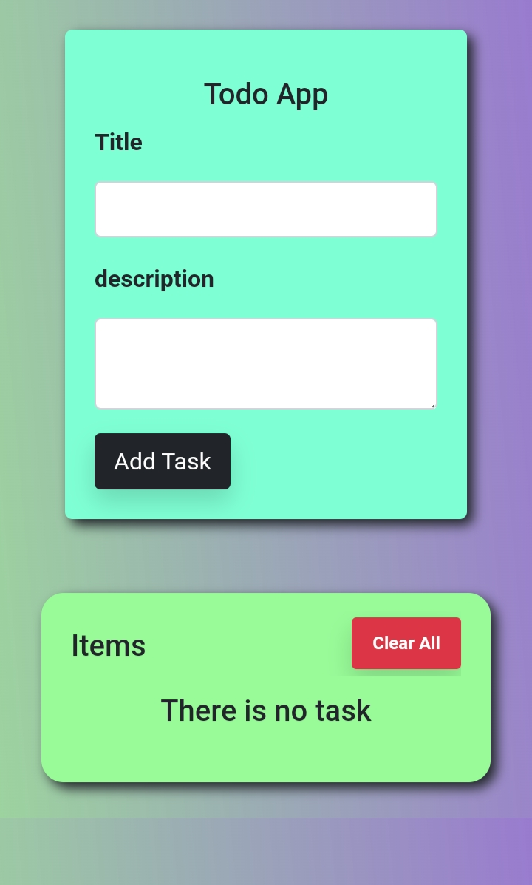
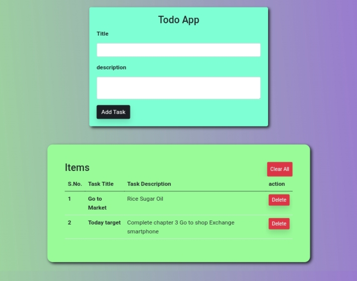

# Todo-JavaScript
<b>Store the user data in local storage (client computer), this will prevent the loss of data by refreshing the page.</b>

check it out the webApp: https://freecode4u.github.io/Todo-JavaScript/  

stored user data on users computer, this make easy to distinct data of one user to other user. it's a simply but important web app which teaches us about local storage and their uses.

 

